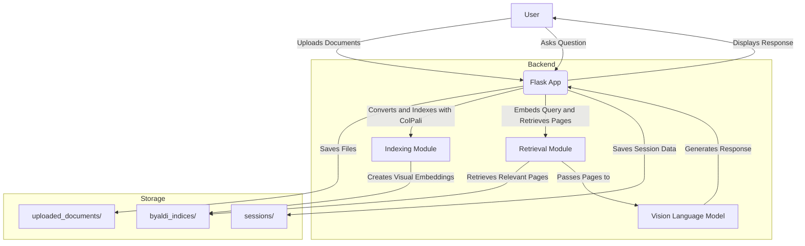

- Anaconda or Miniconda installed on your system
- Python 3.10 or higher

## Installation
Follow these steps to set up and run the application on your local machine:

1. Clone the Repository
   ```bash
   git clone https://github.com/foo/this_repo
   cd this_repo
   ```

2. Create a Conda Environment
   ```bash
   conda create -n this_repo python=3.10
   conda activate this_repo
   ```

3a. Install Dependencies
   ```bash
   pip install -r requirements.txt
   python install_vllm.py
   ```

3b. Install Transformers from HuggingFace - Dev version
   ```bash
    pip uninstall transformers
    pip install git+https://github.com/huggingface/transformers
    pip uninstall byaldi
    pip install git+https://github.com/AnswerDotAI/byaldi.git@bump-to-colpali-engine-0.3.x
   ```

4. Set Environment Variables
   Set your API keys for OpenAI GPT-4:

   ```bash
   export OPENAI_API_KEY='your_openai_api_key'
   ```


5. Run the Application
   ```bash
   python app.py
   ```

6. Access the Application
  Open your web browser and go to:
   ```
   http://localhost:5050/
   ```

## for test
   
If you've deployed this up on Lambda Labs or similar: 
`flask run --host=0.0.0.0 --port=5000`

### for prod
`pip install gunicorn`
`gunicorn --bind 0.0.0.0:5000 wsgi:app`


## Usage
### Upload and Index Documents
1. "New Chat" to start a new session.
2. Under "Upload and Index Documents", click "Choose Files" and select your PDF or image files.
3. Click "Upload and Index". The documents will be indexed using ColPali and ready for querying.

### Ask Questions
1. In the "Enter your question here" textbox, type your query related to the uploaded documents.
2. Click "Send". The system will retrieve relevant document pages and generate a response using the selected Vision Language Model.

### Manage Sessions
- Rename Session: Click "Edit Name", enter a new name, and click "Save Name".
- Switch Sessions: Click on a session name in the sidebar to switch to that session.
- Delete Session: Click "Delete" next to a session to remove it permanently.

### Settings
Has been removed for this version.

## Project Structure
```
root/
├── app.py
├── logger.py
├── models/
│   ├── indexer.py
│   ├── retriever.py
│   ├── responder.py
│   ├── model_loader.py
│   └── converters.py
├── sessions/
├── templates/
│   ├── base.html
│   ├── chat.html
│   ├── settings.html
│   └── index.html
├── static/
│   ├── css/
│   │   └── style.css
│   ├── js/
│   │   └── script.js
│   └── images/
├── uploaded_documents/
├── byaldi_indices/
├── requirements.txt
├── .gitignore
└── README.md
```



# Advanced Document Analysis and Query System

This repository houses a sophisticated document analysis and query system that leverages state-of-the-art natural language processing and computer vision techniques. The system is designed to process, index, and retrieve information from multimodal documents, including text and images, using advanced neural architectures.

## Prerequisites

- Anaconda or Miniconda environment management system
- Python 3.10+ runtime

## System Architecture and Implementation

The application is built on a modular architecture that separates concerns and promotes scalability:

1. **Document Ingestion and Preprocessing**: 
   - Supports various document formats, converting them to a standardized representation.
   - Utilizes ColPali for creating visual embeddings of document pages.

2. **Indexing and Retrieval**:
   - Implements a custom indexing scheme based on visual embeddings.
   - Employs efficient retrieval algorithms for fast and accurate document matching.

3. **Natural Language Understanding**:
   - Integrates cutting-edge Vision Language Models (VLMs) such as Qwen, Gemini, and GPT-4.
   - Enables multimodal reasoning over text and visual content.

4. **Session Management**:
   - Implements a robust session handling system for maintaining user context.
   - Persists session data for continuity across system restarts.

5. **Web Interface**:
   - Provides an intuitive Flask-based web application for user interactions.
   - Supports real-time document uploading, indexing, and querying.

## Installation and Configuration

The system requires a specific environment setup:

1. Clone the repository and navigate to the project directory.
2. Create a dedicated Conda environment with Python 3.10.
3. Install dependencies, including the development version of HuggingFace Transformers.
4. Configure environment variables for API access (e.g., OpenAI API key).

Detailed setup instructions are provided in the repository.

## Usage Workflow

1. **Document Ingestion**: Users upload documents through the web interface.
2. **Indexing**: The system processes and indexes the documents using ColPali's visual embedding technique.
3. **Query Processing**: User queries are embedded and matched against the visual index.
4. **Information Retrieval**: Relevant document pages are retrieved based on semantic similarity.
5. **Response Generation**: A VLM processes the query and retrieved pages to generate a comprehensive response.
6. **Result Presentation**: The system displays the generated response along with relevant document snippets.

## System Components

- `app.py`: Core application logic and API endpoints.
- `models/`: Modules for indexing, retrieval, and response generation.
- `templates/` and `static/`: Frontend assets and templates.
- `sessions/`: Session data persistence.
- `uploaded_documents/` and `byaldi_indices/`: Document and index storage.

## Future Enhancements

Potential areas for improvement include:
- Integration of more advanced retrieval techniques
- Expansion of supported document formats and languages
- Enhancement of the user interface for more intuitive interactions.

